# 🧠 MoneyMind AI

> **An AI-powered autonomous financial agent that analyzes spending behavior, predicts financial outcomes, and helps users make smarter money decisions.**

🌐 Live Demo: https://moneymind-nomics.vercel.app/

---

# 🚀 What is MoneyMind?

MoneyMind AI is a next-generation personal finance platform designed to act like an intelligent financial advisor.

Instead of only tracking expenses, MoneyMind understands financial behavior, predicts future risks, simulates decisions, and continuously guides users toward better financial outcomes.

It combines:
- AI-driven analysis
- Predictive finance
- Behavioral insights
- Autonomous monitoring
- Real-time financial simulations

---

# 🎯 The Problem

Managing money is becoming increasingly complex.

Most people:
- Don’t know where their money actually goes
- Cannot predict future financial problems
- Make emotional spending decisions
- Struggle to balance savings, goals, and lifestyle
- Lack personalized financial guidance

Traditional finance apps only show numbers.
They don’t explain behavior or help users make decisions.

---

# 💡 Our Solution

MoneyMind AI acts as an autonomous financial intelligence system.

It:
- Tracks spending patterns
- Detects risky financial behavior
- Predicts future expenses
- Simulates financial decisions
- Generates personalized AI insights
- Continuously monitors financial health

The platform adapts to:
- User spending habits
- Income patterns
- Financial goals
- Country-specific financial realities

---

# 🧠 Core Features

## 📊 AI Financial Dashboard

- Income, spending & savings overview
- Financial Stability Score
- Smart AI-generated insights
- Savings health tracking
- Risk detection

---

## 🧠 Behavioral Finance Analysis

MoneyMind analyzes user behavior patterns and generates:

- Financial personality detection
- Habit analysis
- Spending psychology insights
- Actionable improvement plans
- Estimated savings impact

Example:
> “Frequent late-night impulse purchases are slowing your emergency fund growth.”

---

## ⚖️ AI Decision Engine

Users can ask:

> “Can I afford a ₹8L car?”
> “Should I start a ₹5000 SIP?”
> “Can I move to a more expensive apartment?”

MoneyMind evaluates:
- Income
- Savings
- Risk
- Goals
- Emergency runway
- Predicted future expenses

Then returns:
- Recommendation
- Risk level
- Trade-offs
- Long-term impact

---

## 🔮 Predictive Intelligence

MoneyMind predicts future financial conditions using:
- Spending history
- Weighted trend analysis
- Behavioral patterns
- Essential vs lifestyle spending
- Seasonal & weekend trends

Outputs include:
- Next month expense prediction
- Spending trajectory
- Financial stress indicators

---

## 🎮 Scenario Simulation Engine

Users can simulate “what-if” decisions in real time.

Examples:
- Buy a new laptop
- Start investing monthly
- Reduce food delivery spending
- Increase savings rate

MoneyMind instantly shows:
- Goal delays
- Risk increase
- Savings impact
- Financial survival months

---

## 🎯 Smart Goal System

Users can:
- Create financial goals
- Track progress
- Predict completion timelines
- Receive AI-generated recommendations

AI adapts recommendations based on:
- User income
- Spending behavior
- Country economy
- Current savings rate

---

## 🤖 Autonomous AI Agent

MoneyMind continuously monitors finances in the background.

The autonomous worker system:
- Detects financial risks
- Generates insights
- Sends reminders
- Tracks progress
- Updates predictions automatically

Triggers include:
- 🚨 Overspending alerts
- 🎯 Goal milestones
- 📈 Savings improvements
- ⚠️ Financial risk warnings

---

## 📧 AI Weekly Reports

Automated reports delivered via email:
- Spending summaries
- Financial score updates
- Personalized recommendations
- Goal progress tracking

---

## 🧪 Demo Mode

Users can instantly explore MoneyMind without uploading personal financial data.

Demo personas include:
- 👨‍🎓 Student
- 👩‍💻 Young Professional
- 👨‍👩‍👧 Family Budget
- 🧑‍🎨 Freelancer

Each profile contains:
- Realistic financial transactions
- AI insights
- Predictions
- Goals
- Spending behaviors

---

## 🔄 High-Level Flow

User → Frontend → API Layer  
→ MongoDB Storage  
→ AI Engine (Gemini)  
→ Background Workers  
→ Predictions & Notifications

---

# ⚡ Architecture Highlights

## 🔹 Modular AI Pipeline

MoneyMind separates:
- Lightweight ingestion jobs
- Heavy AI analysis workers

This improves:
- Scalability
- Performance
- Cost optimization

---

## 🔹 Background Worker System

Scheduled workers handle:
- AI analysis
- Predictions
- Notifications
- Weekly reports
- Goal monitoring

Without blocking user interactions.

---

# ⚙️ Tech Stack

## 🖥️ Frontend
- Next.js App Router
- React
- Tailwind CSS
- Framer Motion

## 🧩 Backend
- Next.js API Routes
- Node.js

## 🗄️ Database
- MongoDB
- Mongoose

## 🤖 AI Layer
- Google Gemini API
- Custom financial reasoning engine

## 🔄 Background Jobs
- Cron workers
- Autonomous processing system

## 📧 Notifications & Email
- Nodemailer

---

# 📊 Dataset & AI Training

## 🧪 Demo Data
Synthetic financial datasets used for onboarding and testing.

## 🌍 Realistic Financial Datasets

We use Kaggle datasets inspired by real-world banking behavior:

- [Daily Transactions Dataset](https://www.kaggle.com/datasets/prasad22/daily-transactions-dataset)
- [Indian Bank Statement Dataset](https://www.kaggle.com/datasets/devildyno/indian-bank-statement-one-year)

Used for:
- Spending pattern analysis
- Prediction modeling
- Behavioral simulations

⚠️ All datasets are anonymized.

---

# 📸 Screenshots

## 🏠 Dashboard (Analyze Page)
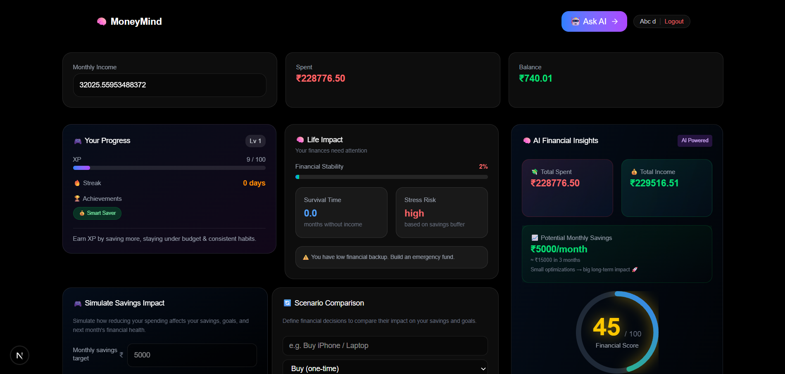
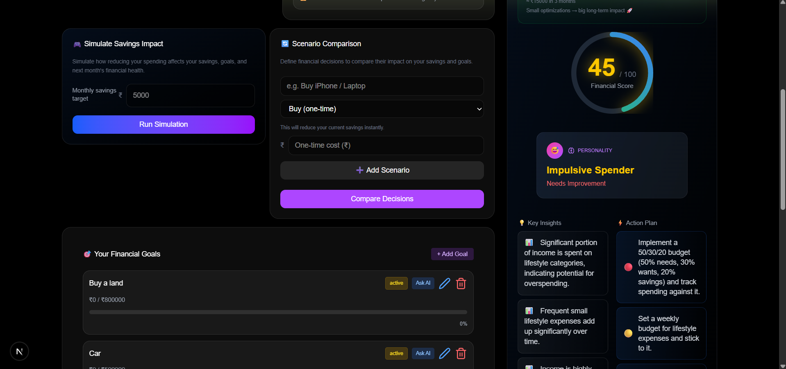
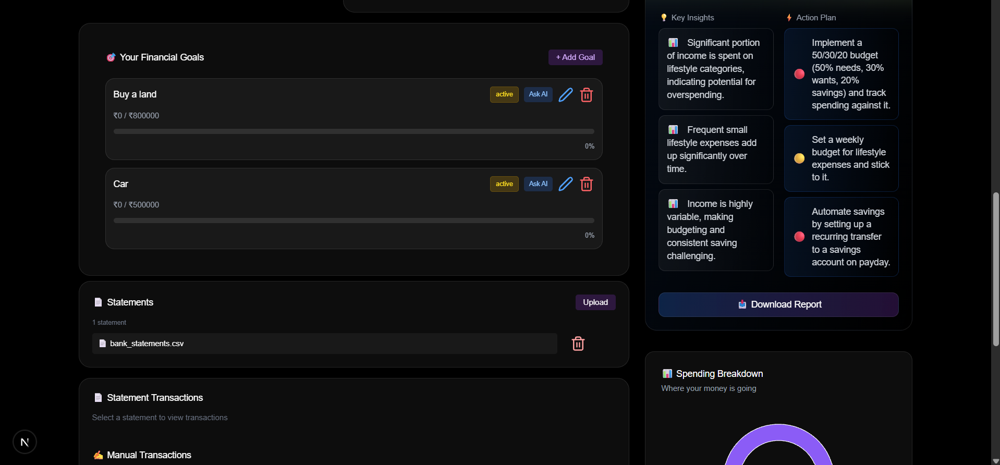
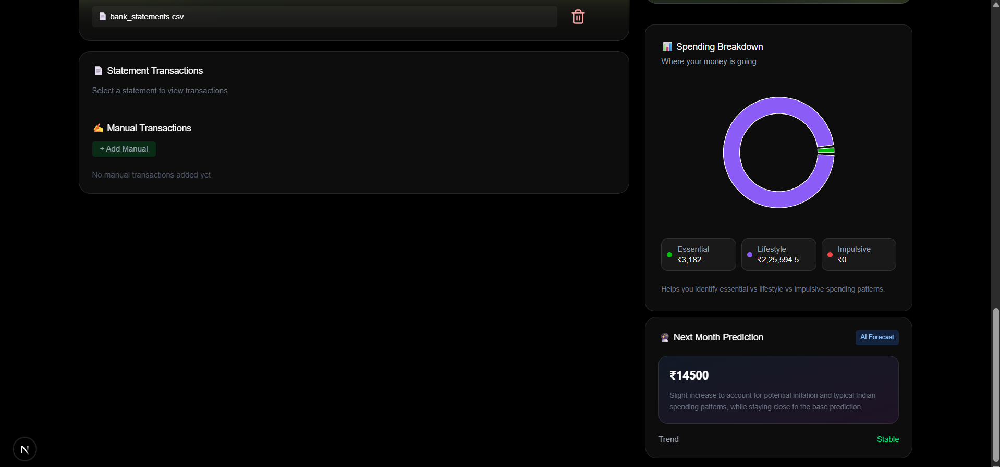

---

## 🧠 AI Analysis


---

## 🤖 Ask AI
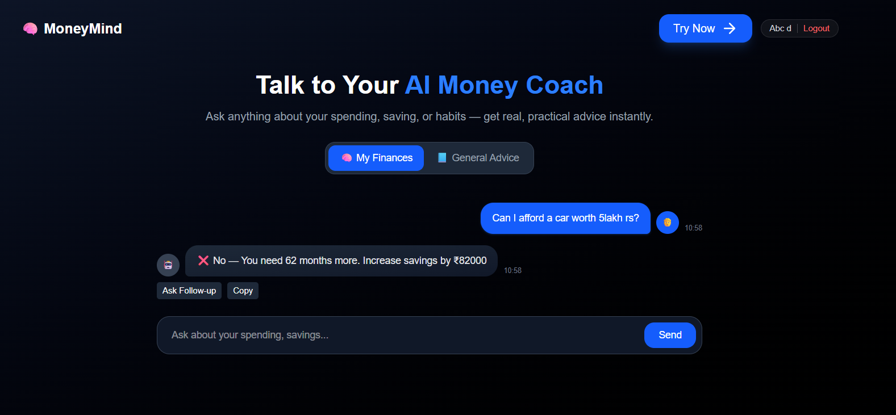
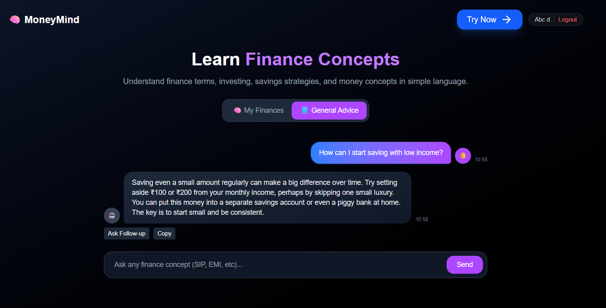

---

## 🔮 Spending BreakDown & Prediction


## Scenario Comparison
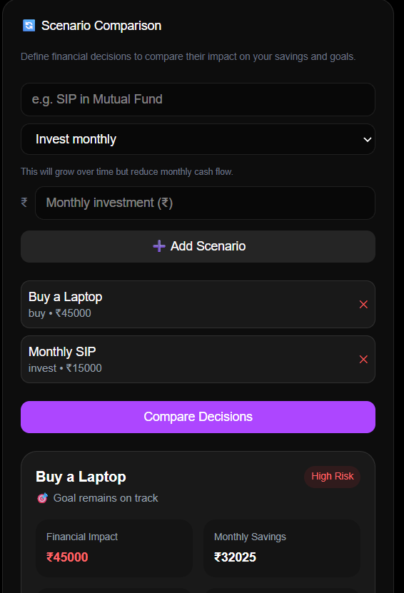
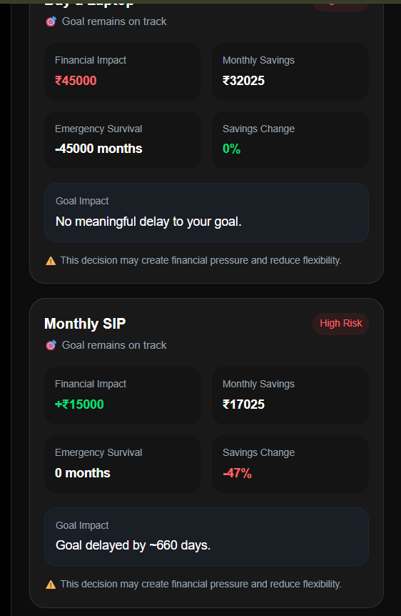
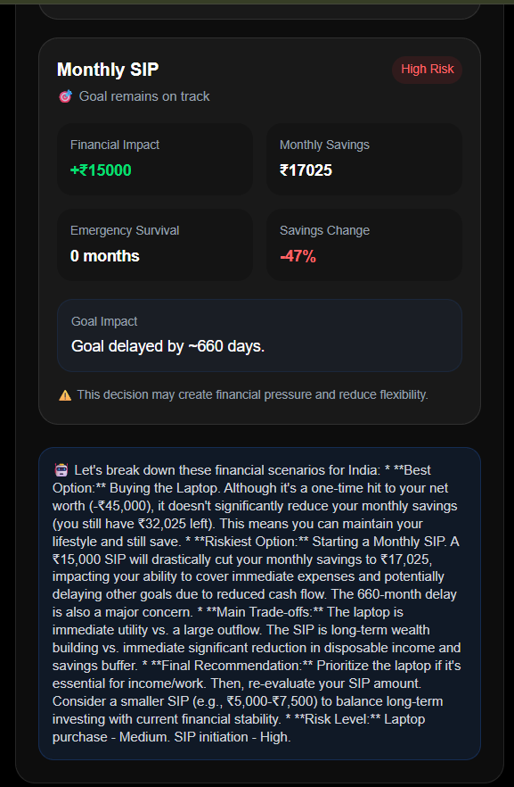


## Savings Impact Simulation
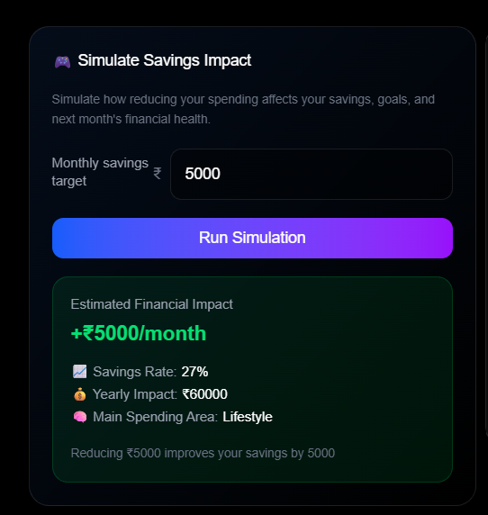
---

## 📄 Statement Upload


## 📄 Profile
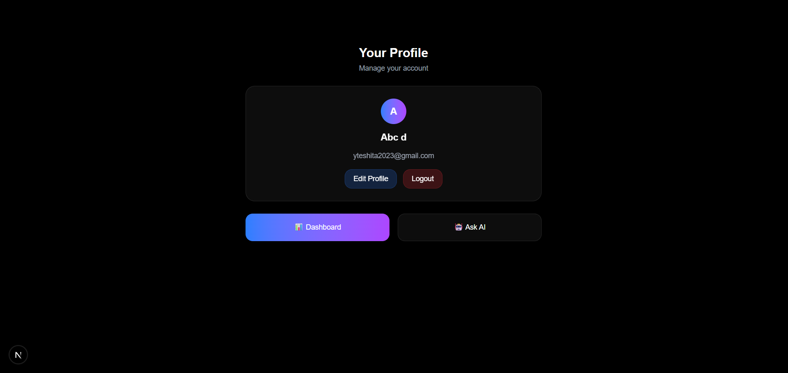

---

# 🎥 Demo Flow

1. Launch demo mode
2. Explore AI insights
3. Ask financial questions
4. Run simulations
5. View predictions
6. Track goals
7. Receive autonomous recommendations

---

# 📁 Project Structure

```bash
/app
  /chat
  /analyze
  /profile

/api
  /register
  /auth
  /profile
  /uploadFile
  /internal/trigger_workers
  /worker/process-statements
  /worker/analyze-finances
  /chat
  /follow-up
  /statements
  /transaction
  /goals
  /loadDemo
  /scenario
  /simulate
  /notifications

/models
  Finance.ts
  Notification.ts
  Statement.ts
  User.ts

/lib
  /ai
  /demoData
  canAfford.ts
  convertToPdf.ts
  convex.ts
  createNotification.ts
  currencyMap.ts
  db.ts
  sectionColors.ts
  simulateSavings.ts
  statementParseHelpers.ts
  utils.ts

/components
  AddGoalModal
  AddTransactionModal
  AIAnalysis
  DemoAnalysis
  DemoChat
  DemoDataModal
  EditGoalModal
  EditProfileModal
  EditTransactionModal
  ExitDemoBanner
  Footer
  GamificationCard
  GoalsSection
  HowItWorks
  LifeImpactCard
  NotificationToaster
  Providers
  ScenarioEngine
  ScoreCard
  ScoreMeter
  SignInModal
  SignUpModal
  SpendingChart
  StatementsCard
  TransactionTable
  UploadStatement
  ```

## 🙌 Author

Built with ❤️ for real-world impact