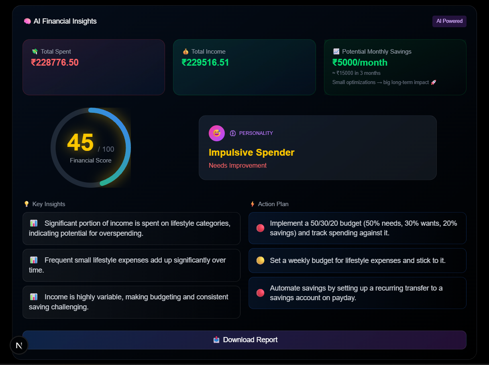
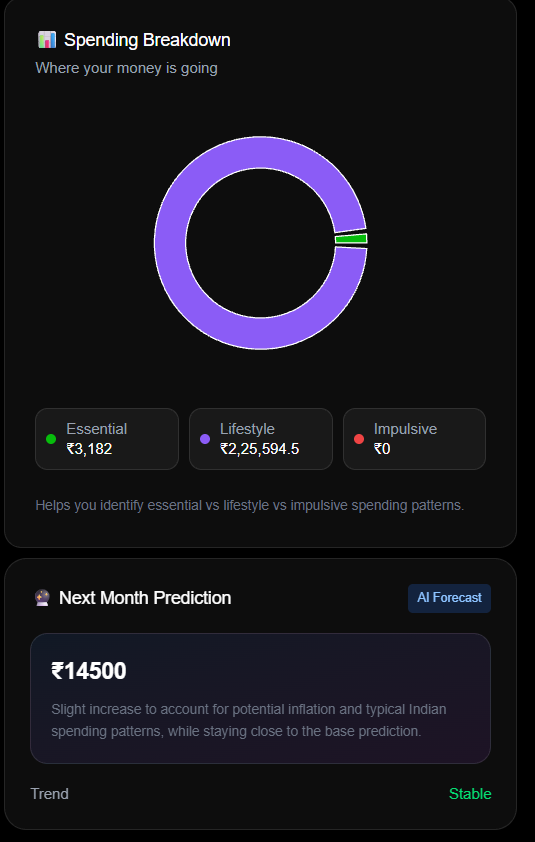
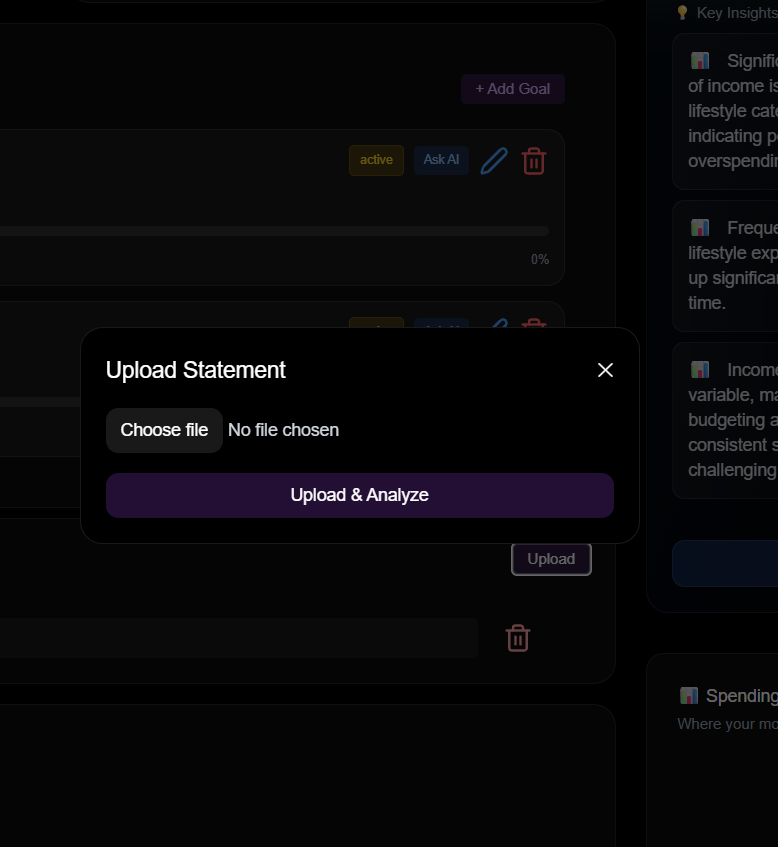

# [🧠 MoneyMind](https://moneymind-nomics.vercel.app/)

> **An autonomous financial agent that analyzes spending, predicts future outcomes, and helps users make smarter financial decisions.**

---

## 🚀 Overview

**MoneyMind AI** is a next-generation financial assistant that goes beyond expense tracking.
It understands your behavior, predicts your future, and helps you make real-world financial decisions.

---

## 🎯 Problem

Most people:

- Don’t know where their money goes
- Can’t predict future expenses
- Struggle with big financial decisions

---

## 💡 Solution

MoneyMind AI acts like a **personal financial advisor**:

- 📊 Tracks & analyzes spending
- 🧠 Detects behavioral patterns
- 🔮 Predicts future expenses
- ⚖️ Helps make decisions
- 🔄 Continuously improves with time

---

## 🧠 Core Features

### 📊 AI Dashboard

- Income / Spending / Balance overview
- Financial Health Score (0–100)
- Smart insights

---

### 🧠 AI Behavioral Analysis

- Personality detection (e.g., impulsive spender)
- Key insights
- Actionable fixes
- Savings impact

---

### ⚖️ Decision Engine (🔥 Core)

Ask:

> “Can I afford a car worth ₹8,00,000?”

AI responds with:

- ✅ Yes / ❌ No
- Reason
- Suggestions

---

### 🔮 Expense Prediction

- Predicts next month’s expenses
- Uses:
  - Last 30-day spending
  - 3-month weighted trends
  - Category behavior (Essential, Lifestyle, Impulsive)
  - Weekend patterns

---

### 🎮 Simulation Engine

- Try “what-if” scenarios
- Example:
  - Reduce ₹5000 → see future impact instantly

---

### 🔄 Autonomous Agent

- Monitors user continuously
- Triggers:
  - 🎉 Goal achieved
  - 🚀 Progress updates
  - ⚠️ Risk alerts

---

### 📧 Weekly Reports

- AI-generated financial summaries
- Sent automatically via email

---

## 🏗️ Architecture


### 🔁 Flow

User → Frontend → Backend APIs
→ MongoDB (Data Storage)
→ AI Engine (Gemini)
→ Worker (Analysis + Prediction)
→ Notifications & Email

---

## ⚙️ Tech Stack

### 🖥️ Frontend

- Next.js (App Router)
- React
- Tailwind CSS
- Framer Motion

### 🧩 Backend

- Next.js API Routes
- Node.js

### 🗄️ Database

- MongoDB (Mongoose)

### 🤖 AI Layer

- Google Gemini API
- Custom financial logic

### 🔄 Background Jobs

- Worker / Cron system

### 📧 Email

- Nodemailer

---

## 📊 Dataset

### 🧪 Demo Data

- Synthetic financial transactions
- Used for controlled demo

### 🌍 Kaggle Dataset

- We use Kaggle datasets which are derived from real-world financial patterns, so our AI is trained on realistic spending behavior

* Real-world inspired financial datasets from Kaggle
   -  [Daily Transactions Dataset](https://www.kaggle.com/datasets/prasad22/daily-transactions-dataset)
   -  [Indian Bank Statement (One Year)](https://www.kaggle.com/datasets/devildyno/indian-bank-statement-one-year)
* Includes:
  - Transaction history
  - Spending patterns
  - Time-based data
⚠️ Note: Data is anonymized and used only for analysis.

---

## 📸 Screenshots

### 🏠 Dashboard


### 🧠 AI Analysis



### 🤖 Decision Engine


### 🔮 Prediction



### 📄 Upload



---

## 🎥 Demo Flow

1. Use demo data
2. View AI insights
3. Ask: _“Can I afford a car?”_
4. See prediction
5. Simulate improvement
6. Watch AI update decision

---

## 📁 Project Structure

```
/app
  /analyze
  /chat
  /profile

/api
  /uploadFile
  /process-statements
  /analyze-finances
  /chat
  /profile

/models
  Finance.js
  Statement.js
  User.js

/lib
  /ai
  /utils

/components
  UploadStatement
  AddTransactionModal
  TransactionTable
  ScoreCard
  SpendingCharts
  SignInModal
  SignUpModal
  NotificationToaster
  Providers
  DemoChat
  HowItWorks
  Footer
```

---

## ⚡ How It Works

### 1. Data Input

- Upload statements (PDF/CSV)
- Add manual transactions

---

### 2. Processing

- Extract transactions
- Categorize spending
- Store in database

---

### 3. AI Analysis

- Financial score
- Insights
- Personality

---

### 4. Prediction

- Trend-based forecasting
- Behavioral adjustments

---

### 5. Decision Engine

- Uses:
  - Savings
  - Goals
  - Predictions

---

### 6. Automation

- Background worker runs
- Sends:
  - Notifications
  - Emails

---

## 🧪 Future Improvements

- 📈 Advanced ML models
- 🏦 Bank API integration
- 📱 Mobile app
- 🧠 Personalized coaching
- 📊 Advanced charts

---

## 🌍 Real-World Impact

MoneyMind AI helps users:

- Understand spending
- Make smarter decisions
- Avoid financial mistakes
- Achieve goals faster

---

## 🏆 Why This Project Stands Out

- 🧠 AI-driven decision making
- 🔮 Predictive intelligence
- ⚡ Autonomous system
- 🌍 Real-world use case
- 🚀 Scalable SaaS-ready architecture

---

## 🎯 One-Line Pitch

> **MoneyMind AI is an autonomous financial agent that analyzes spending, predicts future outcomes, and helps users make smarter financial decisions.**

---

## 🙌 Author

Built with ❤️ for hackathons & real-world impact
